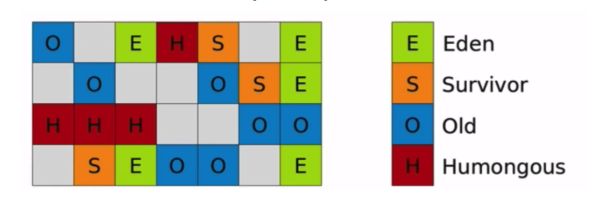

### 堆和GC总结

#### 堆的总结：

1. 堆分为年轻代和永久带，年轻代又分为Eden区和S0，S1区，在不开启jvm的自适应模式下，默认的比例是8:1:1;

2. | 参数                   | 描述                                                      |
   | ---------------------- | --------------------------------------------------------- |
   | -Xms                   | 堆内存初始大小，单位m、g                                  |
   | -Xmx（MaxHeapSize）    | 堆内存最大允许大小，一般不要大于物理内存的80%             |
   | -XX:PermSize           | 非堆内存初始大小，一般应用设置初始化200m，最大1024m就够了 |
   | -XX:MaxPermSize        | 非堆内存最大允许大小                                      |
   | -XX:NewSize（-Xns）    | 年轻代内存初始大小                                        |
   | -XX:MaxNewSize（-Xmn） | 年轻代内存最大允许大小，也可以缩写                        |
   | -XX:SurvivorRatio=8    | 年轻代中Eden区与Survivor区的容量比例值，默认为8，即8:1    |
   | -Xss                   | 堆栈内存大小                                              |

3. 年轻代的GC因为两个幸存区，其中一个一定为空，且理论上对象都是短命的，所以使用的复制式清理垃圾；而老年代不同的GC用的方式不同，G1和并行GC是标记整理，CMS是标记清除，时间久了会很多内存碎片；

4. 新生代的大小问题：新生代的内存小了会导致分配速度上不去，因为老是触发minorGC导致暂停；新生代小了还可能导致过早提升问题，这会导致频繁MajorGC，严重影响吞吐率；

   #### GC总结：

   ##### GC分类：

   

   

1. Serial 收集器

单线程用标记-复制算法，快刀斩乱麻，单线程的好处避免上下文切换，早期的机器，大多是单核，也比较实用。但执行期间，会发生STW(Stop The World)

2. ParNew 收集器

Serial的多线程版本，同样会STW，在多核机器上会更适用。

3. Parallel Scavenge 收集器

ParNew的升级版本，主要区别在于提供了二个参数：-XX:MaxGCPauseMillis 最大垃圾回收停顿时间; -XX:GCTimeRatio 垃圾回收时间与总时间占比，通过这2个参数，可以适合控制回收的节奏，更关注于吞吐率（即：总时间与垃圾回收时间的比例）。

4. Serial Old 收集器

因为老年代的对象通常比较多，占用的空间通常也会更大，如果采用复制算法，得留50%的空间用于复制，相当不划算，而且因为对象多，从1个区，复制到另1个区，耗时也会比较长，所以老年代的收集，通常会采用“标记-整理”法。从名字就可以看出来，这是单线程(串行)的， 依然会有STW

5. Parallel Old 收集器

一句话：Serial Old的多线程版本

6. CMS 收集器

全称：Concurrent Mark Sweep，从名字上看，就能猜出它是并发多线程的。

6.1 Inital Mark 初始标记： 初始标记的目标是标记所有的根对象，包括根对象直接引用的对象，以及被年轻代中所有存活对象所引用的对象（老年代单独回收），**这个过程会STW**。

6.2 Concurrent Mark 并发标记：根据上一步的结果，继续向下标识所有关联的对象，直到这条链上的最尽头。这个过程是多线程的，虽然耗时理论上会比较长，但是其它工作线程并不会阻塞，没有STW。

6.3 并发预清理：因为前一阶段【并发标记】与程序并发运行，可能有一些引用关系已经发生了改变。如果在并发标记过程中引用关系发生了变化，JVM会通过“ Card（卡片） ”的方式将发生了改变的区域标记为“脏”区。

6.4 可取消的并发预清理：本阶段尝试在 STW 的 Final Remark阶段 之前尽可能地多做一些工作。本阶段的具体时间取决于多种因素，因为它循环做同样的事情，直到满足某个退出条件( 如迭代次数，有用工作量，消耗的系统时间等等)。

6.5  Remark 再标志：为啥还要再标记一次？因为第2步并没有阻塞其它工作线程，其它线程在标识过程中，很有可能会产生新的垃圾。试想下，高铁上的垃圾清理员，从车厢一头开始吆喝“有需要扔垃圾的乘客，请把垃圾扔一下”，一边工作一边向前走，等走到车厢另一头时，刚才走过的位置上，可能又有乘客产生了新的空瓶垃圾。所以，要完全把这个车厢清理干净的话，她应该喊一下：所有乘客不要再扔垃圾了（STW）,然后把新产生的垃圾收走。当然，因为刚才已经把收过一遍垃圾，所以这次收集新产生的垃圾，用不了多长时间（即：STW时间不会很长）

6.6 Concurrent Sweep：并行清理，这里使用多线程以“Mark Sweep-标记清理”算法，把垃圾清掉，其它工作线程仍然能继续支行，不会造成卡顿。等等，刚才我们不是提到过“标记清理”法，会留下很多内存碎片吗？确实，但是也没办法，如果换成“Mark Compact标记-整理”法，把垃圾清理后，剩下的对象也顺便排整理，会导致这些对象的内存地址发生变化，别忘了，此时其它线程还在工作，如果引用的对象地址变了，就天下大乱了。另外，由于这一步是并行处理，并不阻塞其它线程，所以还有一个副使用，在清理的过程中，仍然可能会有新垃圾对象产生，只能等到下一轮GC，才会被清理掉。

虽然仍不完美，但是从这6步的处理过程来看，以往收集器中最让人诟病的长时间STW，通过上述设计，被分解成二次短暂的STW，所以从总体效果上看，应用在GC期间卡顿的情况会大大改善，这也是CMS一度十分流行的重要原因。

7. G1 收集器

   G1的全称是Garbage-First，它对于heap区的内存划思路很新颖，有点算法中分治法“分而治之”的味道,构建回收集的原则是： 垃圾最多的小块会被优先收集。这也是G1名称的由来。G1收集器的设计目标是取代CMS收集器，它同CMS相比，在以下方面表现的更出色： 

   - G1是一个有整理内存过程的垃圾收集器，不会产生很多内存碎片（H区因为连续存储，大概率有碎片）

   - G1的Stop The World(STW)更可控，G1在停顿时间上添加了预测机制，用户可以指定期望停顿时间

     

     每个内存分段都可以被标记为Eden区，Survivor区，Old区，或者Humongous区。这样属于不同代，不同区的内存分段就可以不必是连续内存空间了。

     在每个分区内部又被分成了若干个大小为512 Byte 卡片（Card），标识堆内存最小可用粒度。所有分区的卡片将会记录在全局卡片表（Global Card Table）中，分配的对象会占用物理上连续的若干个卡片，当查找对分区内对象的引用时便可通过记录卡片来查找该引用对象（见 RSet）。每次对内存的回收，都是对指定分区的卡片进行处理。

     另外与之前垃圾回收器不同的是增加了一个Humongous区，表示这些Region存储的是巨大对象（humongous object，H-obj），即大小大于等于region一半的对象,其直接属于老年代，H-obj在全局并发标记清理阶段和Full GC阶段回收不再存活的对象。

     从 GC 算法的角度，G1 选择的是复合算法，可以简化理解为：

     - 在新生代，G1 采用的仍然是并行的复制算法，所以同样会发生 Stop-The-World 的暂停，其叫MinorGC，用的并行复制算法。

     - 在老年代，大部分情况下都是并发标记，而整理（Compact）则是和新生代 GC 时捎带进行，并且不是整体性的整理，而是增量进行的，其换了叫法，叫Mixed GC,并发标记结束后，JVM 就有足够的信息进行垃圾收集，Mixed GC 不仅同时会清理 Eden、Survivor 区域，而且还会清理部分 Old 区域。
     - FullGC,在并发标记结束不及时，MixedGC还在进行时堆就满了，便会触发，其在老版本是最差的单线程串行GC，但是升级版本，已经是并行GC了。

     RSet介绍：

     在串行和并行收集器中，GC 通过整堆扫描，来确定对象是否处于可达路径中。然而 G1 为了避免 STW 式的整堆扫描，在每个Region记录了一个RSet（Remembered Set）），内部类似一个反向指针，记录引用分区内对象的Card索引。当要回收该分区时，通过扫描分区的 RSet，来确定引用本分区内的对象是否存活，进而确定本分区内的对象存活情况。我们知道每个Region默认按照512Kb划分成多个Card，所以RSet需要记录的东西应该是 xx Region的 xx Card。

     为什么用反向指针？

     因为新生代中的复制算法本质还是在另一区域创建新对象，用反向指针更方便维护原有的新生代与老年代之间的引用关系。

     G1中一共有五种分区间的引用关系：

     - 分区内引用
     - 新生代分区Y1引用新生代分区Y2
     - 新生代分区Y1引用老年代分区O1
     - 老年代分区O1引用新生代分区Y1
     - 老年代分区O1引用老年代分区O2

   #### G1调优总结：

   - 如果发现 Young GC 非常耗时，这很可能就是因为新生代太大了，我们可以考虑减小新生代的最小比例。-XX:G1NewSizePercent，降低其最大值同样对降低 Young GC 延迟有帮助。-XX:G1MaxNewSizePercent。如果我们直接为 G1 设置较小的延迟目标值，也会起到减小新生代的效果，虽然会影响吞吐量。
   - 如果是 Mixed GC 延迟较长，减少一次处理的 region 个数，就是个直接的选择之一。 G1OldCSetRegionThresholdPercent 控制其最大值，还可以利用参数-XX:G1MixedGCCountTarget提高 Mixed GC 的个数，当前默认值是 8，Mixed GC 数量增多，意味着每次被包含的 region 减少。
   - 如果引起了FullGc:首先通过printgcdetail 查看fullgc频率以及时长
     ，通过dump 查看内存中哪些对象多，这些可能是引起fullgc的原因，看是否能优化
     ，如果堆大或者是生产环境，可以开起jmc 飞行一段时间，查看这期间的相关数据来订位问题。

